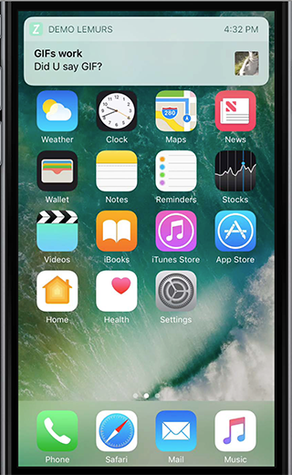
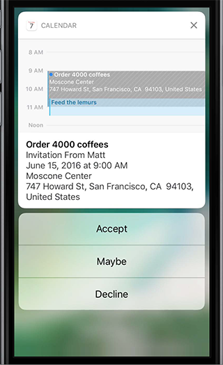
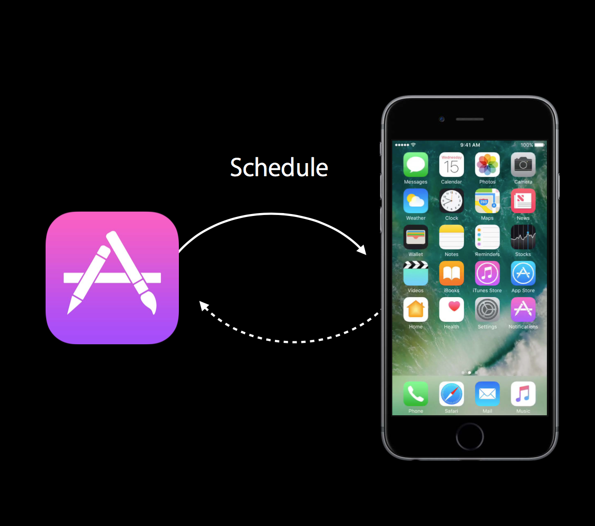

#iOS10推送介绍
-
###概览
iOS10之后，苹果重新定义了通知的界面，下图是iOS10的新界面：
<p align="center"></p> 

<p align="center"></p> 

iOS10的推送丰富了用户反馈的途径，支持3d touch的手机可以通过3d touch来对通知进行响应，开发者还能对通知详情的界面进行自定义，使app的交互更多样化。不仅如此，iOS10之后的推送还能显示图片等多媒体资料。


iOS的推送分为本地推送跟远程推送，iOS10之后苹果把本地推送跟远程推送的api进行了统一。本文从本地推送讲起，分别介绍本地推送以及远程推送的简单使用。

推送的呈现方式有呈现方式有

+ banner
+ alert：这是iOS10之后才有的概念，跟banner的区别是alert要用户操作后才会消失
+ 锁屏界面
+ 通知中心界面
+ app右上角的计数红点（badge）


###本地推送

本地推送不需要通过网络，触发的条件可以是定时的，也可以是定点的。本地推送能在后台或者app运行时触发，iOS10之后，alert（或者banner）能在app前台显示。所有的推送由iOS的通知中心管理。
<p align="center"></p> 
下面通过一个demo来演示本地推送的使用。

+ 请求用户同意接收推送.（记得先
```import UserNotifications```）

```Swift
private func checkAuthorization() {
        print("checking for notification permissions")
        
        let center = UNUserNotificationCenter.current()
        center.getNotificationSettings {
            settings in
            switch settings.authorizationStatus {
            case .notDetermined:
                self.doAuthorization()
            case .denied:
                print("denied, giving up")
            break // nothing to do, pointless to go on
            case .authorized:
                break
            }
        }
    }
    
    private func doAuthorization() {
        print("asking for authorization")
        
        let center = UNUserNotificationCenter.current()
        center.requestAuthorization(options: [.alert, .sound]) { ok, err in
            if let err = err {
                print(err)
                return
            }
            if ok {
                //
            } else {
                print("user refused authorization")
            }
        }
    } 
``` 
+ 定义并发送本地推送消息

	创建本地推送需要经过
	1. 创建触发器
	2. 定义通知内容
	3. 创建一个UNNotificationRequest并在UNUserNotificationCenter实例中添加这个请求
	
	本地推送要通过触发器（trigger）触发，在iOS中就是UNNotificationTrigger的子类。下面是UNNotificationTrigger的4个子类：
	
	+ UNTimeIntervalNotificationTrigger
	+ UNCalendarNotificationTrigger
	+ UNLocationNotificationTrigger
	+ UNPushNotificationTrigger

	对应的应用场景是倒计时，指定日期，指定位置以及推送。
	下面是用倒计时触发器创建通知请求的一个例子：
	
	```Swift
	 fileprivate func createNotification() {
        print("创建通知")
        
        //触发器
        let trigger = UNTimeIntervalNotificationTrigger(timeInterval: 10, repeats: false)
        // 定义通知内容
        let content = UNMutableNotificationContent()
        content.title = "你好!"
        content.subtitle = "狗狗!"
        content.body = "你不能咬我"
        content.sound = UNNotificationSound.default()
        //创建添加请求
        let req = UNNotificationRequest(identifier: "dogNotification", content: content, trigger: trigger)
        let center = UNUserNotificationCenter.current()
        center.add(req)
    }
	```

+ 让推送显示图片

	iOS10之后支持向推送中添加图片，添加图片是通过给通知的content增加attachments来实现的，示例代码如下：
	
	```Swift
		let url = Bundle.main.url(forResource: "dog", withExtension: "jpg")!
        
        
        if let att = try? UNNotificationAttachment(identifier: "dog", url: url, options:nil) {
            content.attachments = [att]
            
        } else {
            print("添加附件失败")
        }
	```
+ 给推送增加响应事件
	
	如果你的推送需要有自定义事件处理（通过3d touch或者下拉后出现），则你必须定义一个通知类目（notification category）。定义notification category的代码如下：
	
	```Swift
	private func configureCategory() {
        print("配置category")
        

        let action1 = UNNotificationAction(identifier: "bite", title: "咬")
        let action2 = UNNotificationAction(identifier: "no",
                                           title: "不咬", options: [.foreground])
        let action3 = UNTextInputNotificationAction(identifier: "message", title: "沟通下再决定", options: [], textInputButtonTitle: "发送", textInputPlaceholder: "你好呀～")
        
        var customDismiss : Bool { return false }
        let dog = UNNotificationCategory(identifier: "notificationDemo", actions: [action1, action2], intentIdentifiers: [], options: customDismiss ? [.customDismissAction] : [])
        let center = UNUserNotificationCenter.current()
        center.setNotificationCategories([dog])
        
        _ = action3
    }
	```	
	然后需要在通知的content定义categoryIdentifier
	
	```Swift
	content.categoryIdentifier = "notificationDemo"
	```
	至此，通知的定义就完成了，然后就是接受本地推送消息。
+ 接受本地推送消息

	iOS10之后，接收通知的api被统一了，只需要实现```UNUserNotificationCenterDelegate```里面两个方法：
	+ userNotificationCenter(_ center: UNUserNotificationCenter, willPresent notification: UNNotification, withCompletionHandler completionHandler: @escaping (UNNotificationPresentationOptions) -> Void)
	
	+ func userNotificationCenter(_ center: UNUserNotificationCenter, didReceive response: UNNotificationResponse, withCompletionHandler completionHandler: @escaping () -> Void)
	
	上面方法是接收到通知的时候的回调方法，下面的是用户作出响应时的响应方法
	
	```Swift
	func userNotificationCenter(_ center: UNUserNotificationCenter,
                                willPresent notification: UNNotification,
                                withCompletionHandler completionHandler: @escaping (UNNotificationPresentationOptions) -> Void) {
        
        print("狗叫了")
        
        completionHandler([.sound, .alert])
        
    }
    
    
    
    func userNotificationCenter(_ center: UNUserNotificationCenter, didReceive response: UNNotificationResponse, withCompletionHandler completionHandler: @escaping () -> Void) {
        
        let id = response.actionIdentifier
        
        if id == "bite" {
            delay(1) {
                self.createNotification()
            }
        }
        
        
        if let textresponse = response as? UNTextInputNotificationResponse {
            let text = textresponse.userText
            print("输入了 \(text)")
        }
        
        
        completionHandler()
    }
	```
	实际运行效果如下：
	<p align="center"></p> 
	<p align="center"></p> 
	
更酷的东西在下面，假如我们想完全自定义通知显示的界面，那又怎么做呢？

+ 自定义通知显示界面
<p align="center"></p> 

	这种完全自定义的界面是通过Notification Content Extension来实现的。下面通过实例简单介绍怎么操作。
	
	+ 为app添加extension：file->new->target,选择Notification content,如下图：
	<p align="center"></p> 
	
	+ 在新出现的extension文件中的storyboard自定义界面，这里简单定义如下：
	<p align="center"></p> 
	
 	+ 在对应的ViewController中修改didReceive:notification方法，实例中逻辑比较简单，只需要显示图片，代码如下：
 
 	```Swift
 	func didReceive(_ notification: UNNotification) {
        
        
        let req = notification.request
        let content = req.content
        let atts = content.attachments
        if let att = atts.first, att.identifier == "dog" {
            if att.url.startAccessingSecurityScopedResource() { //
                if let data = try? Data(contentsOf: att.url) {
                    self.imageView.image = UIImage(data: data)
                }
                att.url.stopAccessingSecurityScopedResource()
            }
        }
        self.view.setNeedsLayout()
    }
 	```
+ 修改plist中的UNNotificationExtensionCategory属性值，改成之前创建的categoryIdentifier，让UI跟你的category对应上。
	<p align="center"></p> 
至此所有配置已经完成，实际效果如下：
 <p align="center"></p> 
###远程推送
 <p align="center"></p> 
 	远程推送跟本地推送不一样，远程推送需要Apple Push Notification Service(APNs)以及服务器端程序的配合。这里由于篇幅原因远程推送的原理、怎么配置推送证书暂不介绍，很多第三方平台中均有详细介绍，这里推荐两个第三方推送的平台，在实际项目中使用过效果都不错：
 	[友盟推送] (http://dev.umeng.com/push/ios/integration)
[极光推送] (http://docs.jiguang.cn/jpush/client/iOS/ios_sdk/)

按照第三方平台的教程配置好后，app能正常接收远程的推送。要支持自定义操作以及自定义界面，只需要按照本地推送中的定义notification category以及增加extension即可。


###总结
本文iOS10后的推送新特性通过一个demo进行概括性的介绍。[点击下载源代码](https://github.com/Cj370118568/notes/archive/master.zip)
###参考
+ Programming iOS10 chapter 13
+ WWDC Session 708 Advanced Notifications
+ WWDC Session 707 Introduction to Notifications
+ [Local and Remote Notifications Overview](https://developer.apple.com/library/prerelease/content/documentation/NetworkingInternet/Conceptual/RemoteNotificationsPG/)

