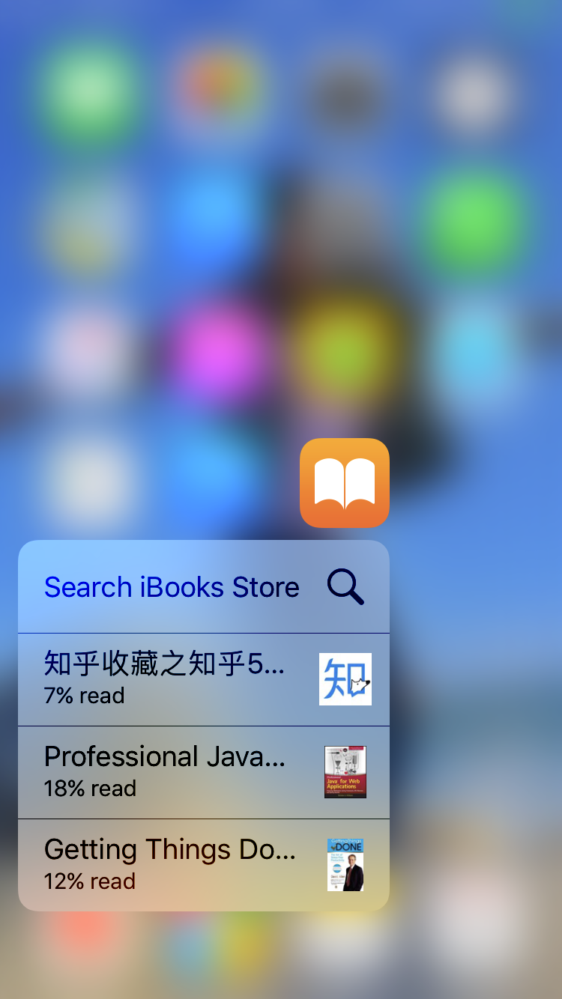
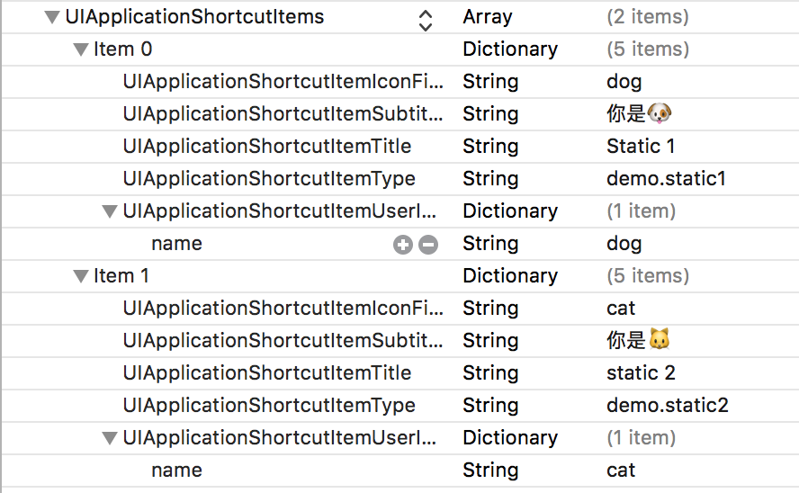
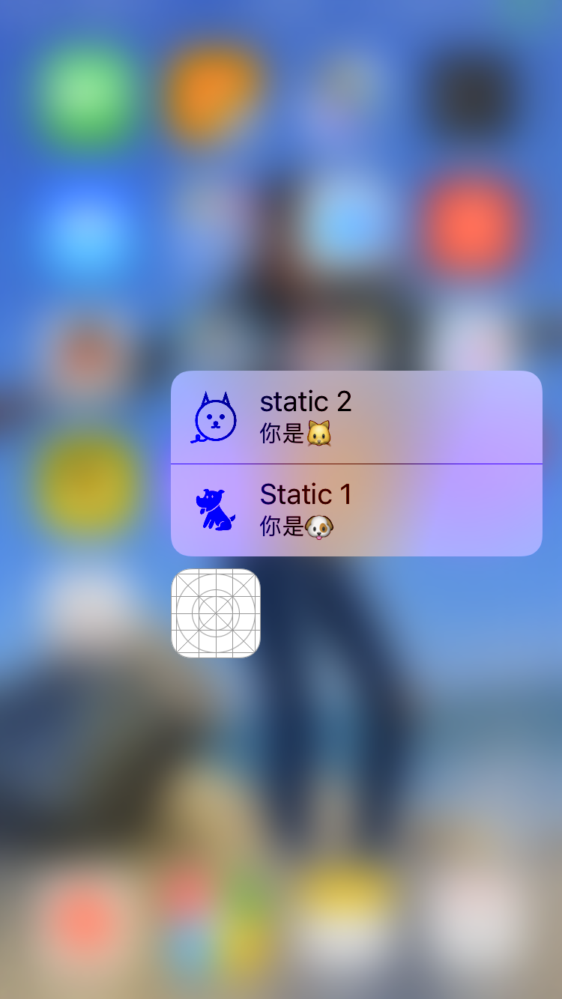
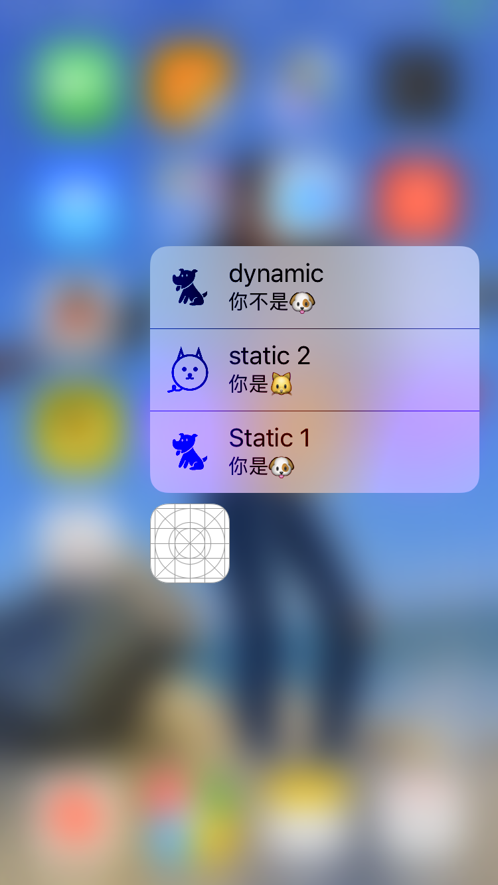

# Quick Actions 介绍
-
### 概览
iPhone 6s以上的设备都支持3d touch，在支持3d touch的设备上使用Quick Actions会有比较好的体验，丰富了交互方式。
<p align="center"></p> 


+ quick actions分为两种

	+ 静态quick actions

		静态的quick actions是在info.plist文件里面定义的，即使你的app从来没有运行，静态的quick actions都能出现。
	
	+ 动态quick actions


		动态quick actions是通过代码定义的，如果你的app没有运行，动态quick actions是不会出现的。
	
	
+ 当用户点击一个quick action，app delegate的方法
```
func application(_ application: UIApplication, performActionFor shortcutItem: UIApplicationShortcutItem, completionHandler: @escaping (Bool) -> Void)
```
会被调用（必要时app会启动）。

+ 每一个quick action都是由UIApplicationShortcutItem的对象定义的。UIApplicationShortcutItem是一个简单的类，只有几个属性：

	+ UIApplicationShortcutItemType（是一个用来标识的字符串，必填）
	
	+ UIApplicationShortcutItemTitle
	+ UIApplicationShortcutItemSubtitle
	+ UIApplicationShortcutItemIconType
	+ UIApplicationShortcutItemIconFile
	+ UIApplicationShortcutItemUserInfo

	下面分别演示通过info.plist定义静态quick action以及通过代码定义动态quick action。
	
+ 静态quick action

	```Swift
	 <key>UIApplicationShortcutItems</key>
    <array>
        <dict>
            <key>UIApplicationShortcutItemIconFile</key>
            <string>dog</string>
            <key>UIApplicationShortcutItemSubtitle</key>
            <string>你是🐶</string>
            <key>UIApplicationShortcutItemTitle</key>
            <string>Static 1</string>
            <key>UIApplicationShortcutItemType</key>
            <string>demo.static1</string>
            <key>UIApplicationShortcutItemUserInfo</key>
            <dict>
                <key>name</key>
                <string>dog</string>
            </dict>
        </dict>
        <dict>
            <key>UIApplicationShortcutItemIconFile</key>
            <string>cat</string>
            <key>UIApplicationShortcutItemSubtitle</key>
            <string>你是🐱</string>
            <key>UIApplicationShortcutItemTitle</key>
            <string>static 2</string>
            <key>UIApplicationShortcutItemType</key>
            <string>demo.static2</string>
            <key>UIApplicationShortcutItemUserInfo</key>
            <dict>
                <key>name</key>
                <string>cat</string>
            </dict>
        </dict>
    </array>
	```
	或者：
	<p align="center"></p> 
	
	
	
	实际运行效果如下：
	<p align="center"></p> 
	
+ 动态quick action

```Swift
let item = UIApplicationShortcutItem(type: "demo.dynamic",
        localizedTitle: "dynamic", localizedSubtitle: "你不是🐶",
        icon: UIApplicationShortcutIcon(templateImageName: "dog"),
        userInfo: ["name":"dog"])
        UIApplication.shared.shortcutItems = [item]
```
实际运行效果如下：
	<p align="center"></p> 
+ 响应quick action事件

当用户点击quick action时，系统会调用```func application(_ application: UIApplication, performActionFor shortcutItem: UIApplicationShortcutItem, completionHandler: @escaping (Bool) -> Void)```这个方法，在里面进行响应就可以了

```Swift 
if shortcutItem.type == "demo.dynamic" {
            if let d = shortcutItem.userInfo {
                if let name = d["name"] as? String {
                    // ... do something with time ...
                    print(name)
                    completionHandler(true)
                }
            }
        }
        completionHandler(false)
```

###总结
本文介绍了quick action的使用。[点击下载源代码](https://github.com/Cj370118568/notes/archive/master.zip)